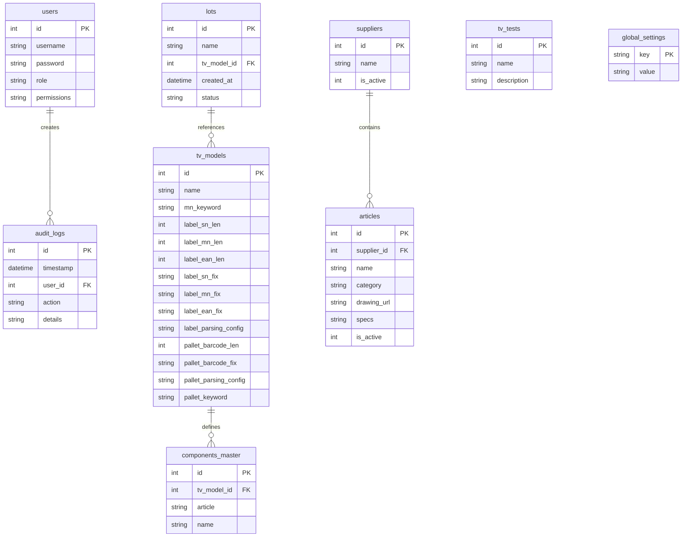

# QMS-DSM Quality Management System

Система для контроля качества и управления процессом инспекции на производстве.

## 🛠 Недавние изменения и оптимизация (Май 2026)

В рамках масштабной технической ревизии кодовой базы были проведены следующие работы:
- **Мониторинг активности пользователей (Real-time Heartbeat & SSE)**: Внедрена система отслеживания активности пользователей в реальном времени. Клиентское приложение каждые 15 секунд отправляет сигнал активности (Heartbeat) с текущим местоположением. Сервер поддерживает реестр активных сессий в памяти, удаляет неактивных пользователей по тайм-ауту (30 секунд) и мгновенно рассылает обновления всем подключенным клиентам через Server-Sent Events (SSE).
- **Интеграция новых производственных ролей (RBAC)**: Для обеспечения полноценного охвата всех этапов производства добавлены новые роли с соответствующими правами и цветовой маркировкой тегов: «Склад» (`Warehouse`), «Производство» (`Production`), «Технолог» (`Technologist`), «Мастер смены» (`Master`) и «Наблюдатель» (`Viewer`).
- **Честный аудит изменений (Data Integrity)**: Достоверность данных (Data Integrity) теперь рассчитывается честно и безопасно на основе флага `is_edited: true` и инкрементируемого поля `updates` в JSON-объекте `data` логов при ручном редактировании записей.
- **Устранение мерцания графиков (Мемоизация)**: Круговой график распределения дефектов на дашборде KPI вынесен в отдельный компонент `LoadDistributionChart` и мемоизирован (`React.memo`) по стабильным метрикам, что полностью устранило визуальное мерцание графика из-за частых SSE-обновлений активности пользователей.
- **Отключение тяжелых анимаций (Оптимизация производительности)**: Полностью удалены анимации плавного открытия страниц (fade-in, slide-up) для «Дашборда качества» и «KPI сотрудников». Отключены анимации перестроения графиков Recharts (`isAnimationActive={false}`) и мерцания карточек при получении обновлений реального времени (SSE/polling). Удалены CSS-переходы для шкал KPI и прогресс-баров. Это минимизировало нагрузку на процессор (CPU/GPU) и устранило зависания на терминалах операторов при обновлении данных.
- **Очистка кодовой базы**: Удалены устаревшие неиспользуемые скрипты и тестовые файлы в корневом каталоге.
- **Оптимизация Frontend**: Устранены все предупреждения ESLint (`no-unused-vars`) на страницах OQA и IQC, что повысило стабильность сборки.
- **Оптимизация Backend**: Убран избыточный спам отладочных логов в консоль в `server.ts` для повышения производительности и читаемости системных логов.
- **Оптимизация обновлений**: При получении real-time уведомлений от SSE и фонового опроса избыточные анимации мерцания карт и перестроения графиков отключены для экономии ресурсов системы.
- **Консолидация документации**: Полный технический анализ системы перенесен из файла `dsm_qms_analysis.md` непосредственно в `README.md` для централизованного хранения документации.

## Требования к серверу/устройству

Перед установкой убедитесь, что на целевом устройстве установлены:
- **Node.js** (v18 или выше) и **npm**
- **Docker** (для запуска Nginx)
- **Linux** (с поддержкой systemd для автозапуска бэкенда)

---

## 🚀 Как запустить приложение (Быстрый старт)

Для полной установки зависимостей, сборки и автозапуска системы, просто запустите установочный скрипт:

```bash
chmod +x install.sh
./install.sh
```

**Что делает скрипт:**
1. Устанавливает пакеты для Backend (`npm install`).
2. Устанавливает пакеты для Frontend и собирает оптимизированный production бандл (`npm run build`).
3. Копирует файл сервиса `qms-backend.service` в `/etc/systemd/system/` и запускает бэкенд в фоновом режиме.
4. Запускает Nginx внутри **Docker**, проксируя API на бэкенд и раздавая фронтенд.

---

## Как это работает?

* **Фронтенд** компилируется с помощью Vite и раздается статически через Nginx (порт `80`).
* **Бэкенд** работает локально на порту `3001` и управляется системной службой (`systemctl`).
* **Nginx** в Docker использует параметр `host.docker.internal` для обращения к локальному бэкенду.

---

## Полезные команды

### Бэкенд
Проверить статус работы бэкенда:
```bash
sudo systemctl status qms-backend
```

Перезапустить бэкенд (нужно после любых изменений в коде):
```bash
sudo systemctl restart qms-backend
```

Просмотр логов бэкенда:
Внимание: Бэкенд работает как нативный Linux-сервис, а не через Docker!
Все логи пишутся напрямую в файл `backend.log` в корне проекта.
Смотреть логи в реальном времени:
```bash
tail -f backend.log
```
Посмотреть последние 100 строк логов:
```bash
tail -n 100 backend.log
```

### Фронтенд (Nginx)
Проверить статус контейнера Nginx (единственное, что работает в Docker):
```bash
sudo docker ps | grep qms-nginx
```

Перезапустить Nginx:
```bash
sudo docker restart qms-nginx
```

Остановить Nginx:
```bash
sudo docker stop qms-nginx
```


---

# Полный технический и функциональный анализ: QMS-DSM System

## 1. Обзор проекта
**QMS-DSM** — это современная корпоративная система управления качеством (Quality Management System), разработанная для автоматизации процессов технического контроля на производстве телевизионной и бытовой техники. Система охватывает весь цикл контроля качества: от входного контроля поступающих материалов и комплектующих (IQC) до финального контроля готовой продукции, этикеток и отгрузки паллет готовой продукции (OQA).

---

## 2. Архитектура системы
Проект представляет собой клиент-серверное веб-приложение (SPA) с разделением ответственности на независимый Frontend и Backend.

### 🏗 Полная структура проекта

```text
qms-dsm/
├── backend/                  # Серверная часть приложения (Node.js + Express)
│   ├── src/
│   │   ├── server.ts         # Точка входа, API-маршруты, RBAC, аудит, задачи
│   │   ├── db.ts             # Инициализация SQLite, миграции схем и справочников
│   │   └── utils/            # Вспомогательные системные утилиты
│   │       ├── httpClient.ts # Сетевой HTTP-клиент к MES с Retry и таймаутами
│   │       ├── logger.py     # Инфраструктурный логгер Python (стандартный logging + Timed Rotating)
│   │       └── logger.ts     # Системный логгер TypeScript (нативная ротация + стектрейсы)
│   ├── database.sqlite       # Локальная реляционная база данных SQLite
│   ├── package.json          # Зависимости и скрипты backend
│   └── tsconfig.json         # Настройки TS-компилятора для NodeJS
├── frontend/                 # Клиентская часть приложения (React + Vite)
│   ├── src/
│   │   ├── components/       # Общие UI-компоненты
│   │   │   ├── layout/       # Элементы структуры интерфейса
│   │   │   │   └── Sidebar.tsx # Динамическая навигационная панель с правами доступа
│   │   │   └── ui/           # Атомарные UI компоненты
│   │   │       ├── DsmTable.tsx # Универсальная интерактивная таблица
│   │   │       ├── GlobalUI.tsx # Единый провайдер уведомлений и модальных окон
│   │   │       └── ModalPortal.tsx # Контейнер всплывающих окон
│   │   ├── pages/            # Экранные формы и бизнес-логика
│   │   │   ├── iqc/          # Модули входного контроля (Incoming Quality Control)
│   │   │   │   ├── AqlCheck.tsx # Журнал приемочного контроля по AQL
│   │   │   │   ├── ComponentsCheck.tsx # Входной контроль комплектующих со сканированием
│   │   │   │   ├── CoversCheck.tsx # Журнал замеров пластиковых крышек
│   │   │   │   └── PanelsCheck.tsx # Контроль LCD панелей с фотофиксацией
│   │   │   ├── oqa/          # Модули выходного контроля (Outgoing Quality Assurance)
│   │   │   │   ├── LabelsCheck.tsx # Контроль телевизионных этикеток (Alarm-таймер)
│   │   │   │   ├── PalletsCheck.tsx # Приемка готовых паллет (Автоскан режим)
│   │   │   │   ├── PalletsTvView.tsx # Интерфейс просмотра статуса паллет и ТВ
│   │   │   │   ├── PatrolCheck.tsx # Модуль линейного патрулирования (Patrol)
│   │   │   │   └── TvCheck.tsx # Выборочный контроль ТВ (валидация SN/MN)
│   │   │   ├── Admin.tsx     # Панель управления пользователями, лотами, справочниками
│   │   │   ├── AqlCalculator.tsx # Интерактивный калькулятор стандартов выборки AQL
│   │   │   ├── Dashboard.tsx # Глобальный дашборд реального времени
│   │   │   ├── KpiDashboard.tsx # Аналитический дашборд KPI с Live-графиками дефектов
│   │   │   └── Login.tsx     # Форма аутентификации пользователей
│   │   ├── store/            # Глобальные стейт-менеджеры (Zustand)
│   │   │   ├── useAuthStore.ts # Состояние сессии, авторизация, RBAC
│   │   │   └── useDataStore.ts # Синхронизация логов, справочников и UI-триггеров
│   │   ├── types/            # Общие интерфейсы TypeScript
│   │   │   └── index.ts      # Типизация моделей данных
│   │   ├── utils/            # Вспомогательные утилиты и сервисы
│   │   │   ├── api.ts        # Клиент запросов Fetch API с инжекцией JWT и защитой сессии
│   │   │   ├── aql.ts        # Реализация стандартов выборки ISO 2859-1
│   │   │   ├── audio.ts      # Аудио-движок сигналов сканирования (OK / NG)
│   │   │   ├── date.ts       # Утилита форматирования и локализации времени
│   │   │   ├── excel.ts      # Парсер и экспортер отчетов Excel (XLSX)
│   │   │   └── image.ts      # Утилита сжатия и ресайзинга фото дефектов на клиенте
│   │   ├── App.tsx           # Конфигурация маршрутизации (React Router)
│   │   ├── index.css         # Единая дизайн-система, CSS-переменные, темы оформления
│   │   └── main.tsx          # Входной файл сборки React
│   ├── index.html            # Каркас SPA страницы
│   ├── vite.config.ts        # Файл конфигурации сборщика Vite
│   └── package.json          # Зависимости и скрипты frontend
```

---

## 3. Подробное описание ключевых компонентов и файлов

### 🖥 Модули Frontend (Страницы)

#### Панели и Дашборды
- **`Dashboard.tsx`**: Главный экран мониторинга. Предоставляет быструю сводку по состоянию всех IQC и OQA процессов, отображает карточки со счетчиками записей за текущую смену и статусами "OK/NG" с возможностью детального просмотра логов.
- **`KpiDashboard.tsx`**: Продвинутая аналитика и real-time мониторинг. Содержит интерактивные live-графики для визуализации дефектов (распределение Парето, динамика Yield Rate, критичность) и выработки. Интегрирует мемоизированную карточку **«Активность пользователей»**, которая в реальном времени отображает онлайн/оффлайн-статусы сотрудников с приоритетной сортировкой в сети, их роли и текущие открытые страницы.
- **`AqlCalculator.tsx`**: Автономный справочный инструмент для технологов качества. Позволяет мгновенно рассчитать объем выборки, приемочные (Ac) и браковочные (Re) числа на основе размера партии по стандарту ISO 2859-1.

#### Входной контроль (IQC)
- **`AqlCheck.tsx`**: Реализация приемочного контроля партий комплектующих. На основании выбранного поставщика, артикула и размера партии система автоматически вычисляет по таблицам AQL размер выборки, а при вводе обнаруженных дефектов (Minor, Major, Critical) рассчитывает статус партии (Pass/Fail). Поддерживает прямую выгрузку Excel-отчета о приемке.
- **`PanelsCheck.tsx`**: Контроль LCD панелей. Модуль поддерживает работу с веб-карерой устройства для фиксации дефектов (битые пиксели, царапины, засветы) и сжимает изображения на клиенте через HTML5 Canvas.
- **`EpsCheck.tsx`**: Журнал контроля пеновкладышей из пенопласта (EPS). Автоматизирует фиксацию геометрических параметров, влажности и веса изделий с проверкой соответствия ТУ.
- **`CoversCheck.tsx`**: Модуль контроля качества пластиковых крышек и деталей корпуса ТВ.
- **`ComponentsCheck.tsx`**: Специализированный модуль входной проверки специфицированных электронных компонентов с использованием интеграции с MES-базой артикулов.

#### Выходной контроль (OQA)
- **`TvCheck.tsx`**: Модуль выборочной проверки готовых ТВ. Валидирует корректность сканирования серийных номеров (SN) и номеров моделей (MN), сверяет их по маскам моделей и воспроизводит звуковые уведомления для повышения скорости работы оператора.
- **`PalletsCheck.tsx`**: Модуль приемки готовых паллет. Поддерживает режим "Автоскан" — фокус ввода постоянно удерживается на поле штрихкода паллеты, и при сканировании запись мгновенно верифицируется и отправляется на сервер без лишних кликов.
- **`LabelsCheck.tsx`**: Инспекция качества наклеек. Включает высокоточный и энергоэффективный механизм **Alarm Timer** — если в течение часа инспектор не сделал запись о проверке этикеток, соответствующая иконка в Sidebar начинает мигать красным цветом, сигнализируя о критическом пропуске. Алгоритм устойчив к троттлингу фоновых вкладок браузера благодаря расчету временных дельт по Unix-таймстампам (`lastLabelCheckTimestamp`) на 15-секундных интервалах в сочетании со слушателем API `visibilitychange` для мгновенного обновления UI при возврате фокуса.
- **`PatrolCheck.tsx`**: Журнал обходов линии (линейный патруль) с чек-листом для фиксации несоответствий на сборочных конвейерах.

### 🛠 Архитектурные файлы и утилиты
- **`utils/api.ts`**: HTTP-клиент, реализующий защиту сессии. При ошибках токена (401/403) автоматически сбрасывает авторизацию (`logout`), за исключением эндпоинтов авторизации (`/auth/login`, `/auth/verify`), что защищает активную сессию от сброса при случайных опечатках инспектора.
- **`utils/aql.ts`**: Математическое ядро расчетов стандартов AQL (таблицы размеров выборки, уровней контроля Normal, Reduced, Tightened).
- **`backend/src/utils/logger.py`**: Полноценный инфраструктурный логгер ошибок для Python на базе `TimedRotatingFileHandler`. Обеспечивает ведение дневных архивов логов (`qms_app.log` 7 дней, `errors.log` 30 дней) и предотвращение тихих крашей через глобальный `sys.excepthook` на русском языке.
- **`backend/src/utils/logger.ts`**: Нативный логгер на TypeScript для Node.js бэкенда с идентичным функционалом дневной ротации, очистки устаревших архивов и русифицированным форматированием. Использует кастомный парсинг `Error.captureStackTrace` для точного определения имени файла и строки, откуда был вызван лог.
- **`utils/audio.ts`**: Синтезатор сигналов для мгновенного звукового оповещения (короткий приятный писк для "OK", сирена-звонок для "NG/Ошибка").
- **`utils/date.ts`**: Единый стандарт форматирования дат (`DD.MM.YYYY HH:mm:ss`), исключающий расхождения между серверными временными зонами и локальными ПК.
- **`utils/excel.ts`**: Мощная утилита генерации XLSX файлов для выгрузки аналитических отчетов из любого модуля.

---

## 4. Схема Базы Данных (SQLite)

Система базируется на СУБД SQLite 3, схема данных автоматически разворачивается и мигрирует при запуске бэкенда (`backend/src/db.ts`).

### 📊 Таблицы и схемы данных



#### 1. Таблица Пользователей (`users`)
- `id`: INTEGER PRIMARY KEY AUTOINCREMENT — Уникальный идентификатор.
- `username`: TEXT UNIQUE — Имя пользователя в системе.
- `password`: TEXT — Хеш пароля (хешировано через `bcrypt`).
- `role`: TEXT — Системная роль пользователя (`Admin` — Администратор, `Inspector` — Инспектор, `Viewer` — Наблюдатель, `Warehouse` — Склад, `Production` — Производство, `Technologist` — Технолог, `Master` — Мастер смены).
- `permissions`: TEXT DEFAULT '[]' — JSON-массив строк разрешенных модулей доступа (например, `["oqa_tv", "iqc_aql"]`).

#### 2. Таблица Производственных Лотов (`lots`)
- `id`: INTEGER PRIMARY KEY AUTOINCREMENT
- `name`: TEXT UNIQUE — Уникальное наименование партии/заказа.
- `tv_model_id`: INTEGER — Ссылка на модель телевизора из справочника `tv_models`.
- `status`: TEXT DEFAULT 'active' — Статус лота (`active` / `archived`).
- `created_at`: DATETIME DEFAULT CURRENT_TIMESTAMP

#### 3. Универсальные Таблицы Логов Модулей (`{module}_logs` — 9 таблиц)
Все модули (`oqa_tv`, `oqa_pallets`, `oqa_labels`, `iqc_aql`, `iqc_panels`, `iqc_eps`, `iqc_covers`, `iqc_components`, `oqa_patrol`) используют высокопроизводительную и расширяемую структуру таблиц:
- `id`: INTEGER PRIMARY KEY AUTOINCREMENT
- `lot_id`: INTEGER — Ссылка на партию `lots(id)` (для OQA модулей).
- `user_id`: INTEGER — Ссылка на инспектора `users(id)`, выполнившего проверку.
- `date`: TEXT — Дата в формате `YYYY-MM-DD` (для быстрой индексации).
- `status`: TEXT — Глобальный вердикт проверки (`OK` / `NG` / `Pass` / `Fail`).
- `data`: TEXT — JSON-строка, содержащая динамическую структуру результатов замеров, уникальную для каждого модуля.
- `timestamp`: DATETIME DEFAULT CURRENT_TIMESTAMP — Точное время записи.
- **Сгенерированные JSON Колонки (Generated Virtual Columns)**:
  - **`iqc_panels_logs`**: `defect_type` (виртуальное извлечение `$.defect`) и `part_code` (виртуальное извлечение `$.partCode`).
  - **`oqa_tv_logs`**: `defect_type` (виртуальное извлечение `$.defects`) и `tv_model` (виртуальное извлечение `$.model`).
- *Индексы*: Добавлены стандартные индексы `idx_{mod}_date`, `idx_{mod}_lot` и специализированные B-Tree индексы на сгенерированных virtual-колонках (`idx_panels_defect`, `idx_panels_part`, `idx_tv_defect`, `idx_tv_model`) для мгновенного выполнения группировочных KPI-запросов.

#### 4. Справочник Поставщиков (`suppliers`)
- `id`: INTEGER PRIMARY KEY AUTOINCREMENT
- `name`: TEXT UNIQUE — Имя поставщика.
- `is_active`: INTEGER DEFAULT 1 — Флаг активности.

#### 5. Справочник Номенклатуры Комплектующих (`articles`)
- `id`: INTEGER PRIMARY KEY AUTOINCREMENT
- `supplier_id`: INTEGER — Ссылка на `suppliers(id)`.
- `name`: TEXT — Обозначение артикула / детали.
- `category`: TEXT DEFAULT 'General' — Группа компонентов.
- `drawing_url`: TEXT — Ссылка на конструкторский чертеж/документ.
- `specs`: TEXT — Технические требования.
- `is_active`: INTEGER DEFAULT 1

#### 6. Спецификации Моделей ТВ (`tv_models`)
Содержит конфигурационные данные для валидации сканируемых штрихкодов в реальном времени:
- `id`: INTEGER PRIMARY KEY AUTOINCREMENT
- `name`: TEXT — Маркетинговое имя модели.
- `mn_keyword`: TEXT UNIQUE — Ключевое слово для парсинга модели.
- `label_sn_len`, `label_mn_len`, `label_ean_len`: INTEGER — Контрольные длины штрихкодов.
- `label_sn_fix`, `label_mn_fix`, `label_ean_fix`: TEXT — Обязательные префиксы штрихкодов.
- `pallet_barcode_len`: INTEGER — Длина кода паллеты.
- `pallet_barcode_fix`: TEXT — Префикс кода паллеты.

---

## 5. Системные Механизмы и Безопасность

### 🔐 Двухфакторное Подтверждение Операций
При попытке модификации или удаления записей в журналах контроля, система запрашивает подтверждение пароля текущего пользователя. Это защищает систему от случайных правок или несанкционированного удаления данных, если рабочий терминал остался без присмотра.

### 🛡 Предотвращение Сброса Авторизации
Интегрированный в Fetch-клиент механизм проверяет статус ответа сервера. При получении ошибок авторизации (`401`/`403`) сессия сбрасывается только в том случае, если запрос шел к системным модулям, а не к окну ввода пароля подтверждения `/auth/verify`. Это обеспечивает превосходный UX — опечатка инспектора при удалении записи не приводит к полному выбросу из его рабочей учетной записи.

### 💾 SQLite Оптимизации и Резервное Копирование (Backups)
- **Высокая Конкурентность (WAL Mode)**: Соединение с SQLite настроено в режиме **Write-Ahead Logging (WAL)**. Это позволяет осуществлять одновременные операции чтения и записи без взаимного блокирования и исключает возникновение ошибок `SQLITE_BUSY`.
- **Оптимальная Синхронизация (PRAGMA synchronous = NORMAL)**: Использование режима синхронизации `NORMAL` значительно снижает дисковую I/O нагрузку при частых записях, обеспечивая при этом полную сохранность структуры БД.
- **Целостность данных (Foreign Keys)**: При инициализации бэкенда принудительно включается поддержка внешних ключей (`PRAGMA foreign_keys = ON;`).
- **Data Retention**: Автоматический фоновый воркер удаляет устаревшие логи старше заданного в панели администратора количества дней (по умолчанию — 90 дней).
- **Nightly Scheduled Backup**: Высокоинтенсивные мутационные бэкапы удалены. Вместо них внедрена фоновая задача (`node-cron`), которая ежедневно в 20:00 асинхронно выполняет `VACUUM INTO` и сохраняет дамп `backup_YYYY-MM-DD.sqlite` в директорию `backend/backups/`.
- **Политика ротации (14-дневное хранение)**: Внутри cron-задачи реализован алгоритм автоматического сканирования и ротации файлов бэкапов: система сортирует резервные копии по дате модификации и сохраняет только последние 14 дампов, очищая более ранние копии для экономии места на диске.

### 🌐 Резолюция HTTP-Запросов (Интеграция с MES)
Для защиты бэкенд-сервера от блокировок Event Loop и обеспечения отказоустойчивости при интеграции с внешними системами (MES) реализована специализированная обертка HTTP-клиента:
- **Контроль Таймаутов (AbortController)**: Любой запрос к внешней системе защищен встроенным лимитом времени выполнения (по умолчанию 5000 мс) с помощью `AbortController`. Это гарантирует прерывание сетевого зависания на раннем этапе и исключает накопление зависших соединений.
- **Экспоненциальная Retry-Логика**: При возникновении сетевых сбоев или таймаутов клиент автоматически производит до 2 повторных попыток запроса с экспоненциальной задержкой (например, 300 мс и 600 мс) перед объявлением сервиса недоступным.
- **Интеллектуальный Fallback Кэш**: Внедрен механизм оперативного кэширования ответов в памяти бэкенда. При наступлении таймаута (`TimeoutError`) сервер автоматически возвращает последние успешно сохраненные данные от MES, повышая общую отказоустойчивость и непрерывность работы QC-терминалов даже в условиях временного простоя внешних ИТ-систем.

### 💾 Оптимизация JSON через SQLite Generated Columns и Индексацию
Для устранения вычислительных узких мест при парсинге JSON-строк в реальном времени при выборках, фильтрациях и расчетах KPI, база данных переведена на архитектуру со сгенерированными виртуальными колонками:
- **Виртуальные JSON-колонки (VIRTUAL Generated Columns)**: На уровне SQLite таблиц `iqc_panels_logs` и `oqa_tv_logs` добавлены автоматические вычисляемые поля `defect_type`, `part_code` и `tv_model`. СУБД извлекает их из JSON-колонки `data` в момент обращения к строке, затрачивая **0 байт** дискового хранилища для этих колонок.
- **Высокоскоростная B-Tree Индексация**: На сгенерированные virtual-колонки навешены классические B-Tree индексы (`idx_panels_defect`, `idx_panels_part`, `idx_tv_defect`, `idx_tv_model`), что гарантирует бинарный поиск и мгновенную выборку строк вместо медленного последовательного сканирования всей таблицы логов.
- **Выделенный Группировочный API Аналитики**: Внедрен высокопроизводительный эндпоинт `/api/analytics/defects/:module`, агрегирующий виды дефектов непосредственно средствами реляционного движка SQLite с использованием `GROUP BY` и `COUNT(*)` по B-Tree индексам. Это полностью разгрузило CPU серверов и клиентские устройства от накладных расходов JS-маппингов.
- **Безопасная Бесшовная Автомиграция**: Внедрен интеллектуальный механизм обнаружения старой схемы данных при старте бэкенда: система транзакционно переименовывает таблицы, пересоздает их с новыми Generated Columns, восстанавливает существующие лог-записи и отстраивает новые индексы на лету без рисков повреждения структуры БД.

### 🛡 Инфраструктурное логирование ошибок (Error & Infrastructure Logging)
Для предотвращения "молчаливых падений" приложения бэкенда и мгновенного технического мониторинга в терминале реализована продвинутая система инфраструктурного логирования:
- **Дневная ротация с ограничением хранения (Timed Daily Rotation)**: Запись технического состояния ведется в два независимых лог-файла в директории `logs/`. Общий лог `qms_app.log` фиксирует все подробности (от уровня `DEBUG`) и хранит архивы за последние **7 дней**. Выделенный лог сбоев `errors.log` пишет критические ошибки (уровень `ERROR` и выше) и хранит архивы **30 дней**, автоматически очищая устаревший мусор.
- **Русификация системного формата**: Каждое событие выводится в консоль и записывается в файлы на понятном русском техническом языке: `[ИМЯ_МОДУЛЯ] [ДАТА_ВРЕМЯ] [УРОВЕНЬ] -> Сообщение об ошибке (Файл:Линия)`. Для Node.js реализовано нативное чтение кастомного `stackTrace` для автоматического извлечения имени исходного файла и строки.
- **Глобальные ловушки падений (Global Error Exception Catchers)**: Любое необработанное исключение или отклоненный промис (`sys.excepthook` на Python, `uncaughtException` и `unhandledRejection` на Node.js) перехватываются глобально, предотвращая скрытое падение процесса и записывая полный трассировочный след в `errors.log`.
- **Полная интеграция в бизнес-цепочки**: Логирование покрывает ошибки подключения и блокировки БД SQLite (`SQLITE_BUSY`), сбои PRAGMA WAL/Foreign Keys, ошибки `VACUUM INTO` ночного бэкапа, таймауты `AbortController` и сетевые сбои с экспоненциальным Retry при интеграции с MES.

### 📱 Адаптивность мобильных интерфейсов и предотвращение горизонтальных переполнений
Обеспечена полноценная поддержка работы всех терминалов контроля QMS-DSM на мобильных экранах (планшеты, смартфоны со сборочной линии, экраны до 378px по горизонтали):
- **Сетка центрирования и адаптивный сброс высоты**: Всеfixed/absolute оверлеи модальных окон принудительно переключаются в `display: flex; align-items: center; justify-content: center;` с мягким ресайзом панелей `.glass-panel` до 100% ширины и вертикальным скроллом, полностью устраняя риски уплывания модальных диалогов за границы экрана.
- **Стекинг шапок и фильтров через `responsive-header`**: Универсальный CSS-класс `.responsive-header` автоматически реорганизует горизонтальные панели с фильтрами, флажками и полями поиска в вертикально ориентированные колонки с отступами touch-target ($\ge$ 44px) и увеличенным размером шрифтов ($\ge$ 16px для избежания масштабирования в iOS Safari).
- **Сброс горизонтальных колонок в один ряд**: Двухколоночные макеты Sidebar+Content и сетки Kpi/Dashboard динамически переходят в единую вертикальную ленту при просмотре с мобильных разрешений, что предотвращает появление боковой прокрутки и обеспечивает 100% читаемости логов и графиков.

### 🛰 Мониторинг активности пользователей в реальном времени (Heartbeat & SSE)
Для обеспечения контроля за деятельностью инспекторов и операторов непосредственно на линии внедрена отказоустойчивая система отслеживания активности в реальном времени:
- **Механизм Heartbeat**: Клиентское приложение с интервалом в 15 секунд отправляет HTTP POST-запросы к `/api/users/heartbeat`, передавая текущий путь (`location.pathname`), на котором находится пользователь.
- **Реестр активных сессий в памяти**: На стороне сервера Express (`server.ts`) развернут асинхронный реестр активных сессий `activeSessions`. Каждая сессия хранит имя пользователя, его активную роль, текущий раздел системы и метку времени последнего пинга.
- **Автоматическая очистка неактивных пользователей**: Раз в 10 секунд на сервере запускается планировщик очистки. Если от пользователя не поступало сигналов активности (heartbeat) в течение более 30 секунд, сессия признается оффлайн и удаляется из реестра.
- **Real-time трансляция через SSE**: Любое изменение в реестре сессий (подключение нового пользователя, переход на другую страницу, отключение по таймауту) мгновенно транслируется всем активным клиентам через SSE-событие `USER_SESSIONS_UPDATED`.
- **Интерактивная карточка активности на дашборде KPI**: Включает мгновенную сортировку: онлайн-пользователи всегда отображаются вверху списка (в алфавитном порядке), а оффлайн-пользователи — внизу. Возле каждого пользователя выводятся пульсирующий неоновый индикатор статуса, тег роли и фиолетовый бейдж с текущим открытым модулем.

### 🛡 Расчет достоверности данных и честный аудит изменений (Data Integrity)
Для исключения человеческого фактора и обеспечения жесткой прозрачности отчетности:
- **Идентификация ручного редактирования**: При внесении изменений в лог-записи через интерфейс, функция `updateLog` в Zustand-хранилище `useDataStore.ts` внедряет флаг `is_edited: true` и инкрементирует числовой счетчик `updates` непосредственно внутрь JSON-объекта в поле `data` SQLite-таблицы.
- **Честный расчет показателя Integrity**: При расчете KPI на дашборде система суммирует количество записей с флагом `is_edited: true` и сравнивает его с общим пулом записей. Это позволяет вывести 100% достоверный и точный показатель целостности данных без необходимости обращения к тяжелым таблицам аудита.

### ⚡ Мемоизация графиков Recharts (Устранение мерцания)
Частые real-time обновления активности пользователей приводили к повторным рендерам родительского дашборда, что вызывало автоматический перезапуск `ResizeObserver` библиотеки Recharts и приводило к постоянному визуальному мерцанию и перестроению кругового графика распределения дефектов.
Для решения этой проблемы:
- Круговой график вынесен в отдельный компонент `LoadDistributionChart` и обернут в `React.memo`.
- График перерисовывается исключительно при изменении стабильного массива `globalMetrics`, полностью игнорируя фоновые обновления реестра пользовательских сессий, что снизило нагрузку на CPU клиента и устранило неприятное мерцание.

---

## 6. Технологический стек проекта

- **Frontend**: React 18, Vite, TypeScript 5, Zustand 5, React Router DOM 7, Lucide Icons.
- **Backend**: Node.js, Express 5, TypeScript, SQLite3, Python 3 (для инфраструктурных утилит).
- **Интеграция и Экспорт**: XLSX (Excel), HTML5 Canvas image compression.
- **Стилизация**: CSS Variables, Glassmorphism, CSS Transitions & Keyframes.

---

## 7. Выводы по Анализу
Проект **QMS-DSM** представляет собой законченное, зрелое решение корпоративного уровня. Все модули входного и выходного контроля жестко типизированы, связаны с общими справочниками и защищены системой сквозного аудита изменений (`audit_logs`) и всеобъемлющей системой инфраструктурного логирования технических ошибок. Использование легковесной SQLite3 гарантирует портативность и простоту развертывания на любом промышленном ПК без необходимости настройки тяжелых серверов СУБД, при этом гарантируя высокую отказоустойчивость, скорость обработки данных и превосходную мобильную адаптивность для работы непосредственно "на ногах" у сборочной линии.
