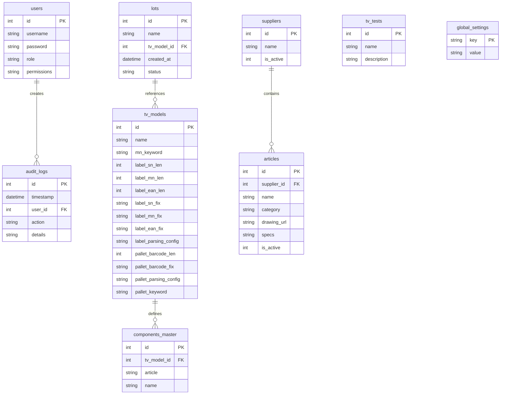

# Полный технический и функциональный анализ: QMS-DSM System

## 1. Обзор проекта
**QMS-DSM** — это современная корпоративная система управления качеством (Quality Management System), разработанная для автоматизации процессов технического контроля на производстве телевизионной и бытовой техники. Система охватывает весь цикл контроля качества: от входного контроля поступающих материалов и комплектующих (IQC) до финального контроля готовой продукции, этикеток и отгрузки паллет готовой продукции (OQA).

---

## 2. Архитектура системы
Проект представляет собой клиент-серверное веб-приложение (SPA) с разделением ответственности на независимый Frontend и Backend.

### 🏗 Полная структура проекта

```text
qms-dsm/
├── backend/                  # Серверная часть приложения (Node.js + Express)
│   ├── src/
│   │   ├── server.ts         # Точка входа, API-маршруты, RBAC, аудит, задачи
│   │   └── db.ts             # Инициализация SQLite, миграции схем и справочников
│   ├── database.sqlite       # Локальная реляционная база данных SQLite
│   ├── package.json          # Зависимости и скрипты backend
│   └── tsconfig.json         # Настройки TS-компилятора для NodeJS
├── frontend/                 # Клиентская часть приложения (React + Vite)
│   ├── src/
│   │   ├── components/       # Общие UI-компоненты
│   │   │   ├── layout/       # Элементы структуры интерфейса
│   │   │   │   └── Sidebar.tsx # Динамическая навигационная панель с правами доступа
│   │   │   └── ui/           # Атомарные UI компоненты
│   │   │       ├── DsmTable.tsx # Универсальная интерактивная таблица
│   │   │       ├── GlobalUI.tsx # Единый провайдер уведомлений и модальных окон
│   │   │       └── ModalPortal.tsx # Контейнер всплывающих окон
│   │   ├── pages/            # Экранные формы и бизнес-логика
│   │   │   ├── iqc/          # Модули входного контроля (Incoming Quality Control)
│   │   │   │   ├── AqlCheck.tsx # Журнал приемочного контроля по AQL
│   │   │   │   ├── ComponentsCheck.tsx # Входной контроль комплектующих со сканированием
│   │   │   │   ├── CoversCheck.tsx # Журнал замеров пластиковых крышек
│   │   │   │   ├── EpsCheck.tsx # Метрологический журнал пеновкладышей (EPS)
│   │   │   │   └── PanelsCheck.tsx # Контроль LCD панелей с фотофиксацией и генерацией PDF
│   │   │   ├── oqa/          # Модули выходного контроля (Outgoing Quality Assurance)
│   │   │   │   ├── LabelsCheck.tsx # Контроль телевизионных этикеток (Alarm-таймер)
│   │   │   │   ├── PalletsCheck.tsx # Приемка готовых паллет (Автоскан режим)
│   │   │   │   ├── PatrolCheck.tsx # Модуль линейного патрулирования (Patrol)
│   │   │   │   └── TvCheck.tsx # Выборочный контроль ТВ (валидация SN/MN)
│   │   │   ├── Admin.tsx     # Панель управления пользователями, лотами, справочниками
│   │   │   ├── AqlCalculator.tsx # Интерактивный калькулятор стандартов выборки AQL
│   │   │   ├── Dashboard.tsx # Глобальный дашборд реального времени
│   │   │   ├── KpiDashboard.tsx # Аналитический дашборд KPI с Live-графиками дефектов
│   │   │   └── Login.tsx     # Форма аутентификации пользователей
│   │   ├── store/            # Глобальные стейт-менеджеры (Zustand)
│   │   │   ├── useAuthStore.ts # Состояние сессии, авторизация, RBAC
│   │   │   └── useDataStore.ts # Синхронизация логов, справочников и UI-триггеров
│   │   ├── types/            # Общие интерфейсы TypeScript
│   │   │   └── index.ts      # Типизация моделей данных
│   │   ├── utils/            # Вспомогательные утилиты и сервисы
│   │   │   ├── api.ts        # Клиент запросов Fetch API с инжекцией JWT и защитой сессии
│   │   │   ├── aql.ts        # Реализация стандартов выборки ISO 2859-1
│   │   │   ├── audio.ts      # Аудио-движок сигналов сканирования (OK / NG)
│   │   │   ├── date.ts       # Утилита форматирования и локализации времени
│   │   │   ├── excel.ts      # Парсер и экспортер отчетов Excel (XLSX)
│   │   │   └── image.ts      # Утилита сжатия и ресайзинга фото дефектов на клиенте
│   │   ├── App.tsx           # Конфигурация маршрутизации (React Router)
│   │   ├── index.css         # Единая дизайн-система, CSS-переменные, темы оформления
│   │   └── main.tsx          # Входной файл сборки React
│   ├── index.html            # Каркас SPA страницы
│   ├── vite.config.ts        # Файл конфигурации сборщика Vite
│   └── package.json          # Зависимости и скрипты frontend
└── dsm_qms_analysis.md       # Системная документация (Данный файл)
```

---

## 3. Подробное описание ключевых компонентов и файлов

### 🖥 Модули Frontend (Страницы)

#### Панели и Дашборды
- **`Dashboard.tsx`**: Главный экран мониторинга. Предоставляет быструю сводку по состоянию всех IQC и OQA процессов, отображает карточки со счетчиками записей за текущую смену и статусами "OK/NG" с возможностью детального просмотра логов.
- **`KpiDashboard.tsx`**: Продвинутая аналитика. Содержит интерактивные live-графики для визуализации распределения видов дефектов (по Парето), мониторинга динамики выхода годных (Yield Rate), распределения дефектов по критичности и индивидуальной выработки контролеров. Интерфейс оптимизирован для вывода на большие экраны (KPI графики расположены в верхней части для мгновенного мониторинга, настроены отступы для 100% читаемости данных). Обновление данных происходит в реальном времени через Server-Sent Events (SSE) без мерцания UI.
- **`AqlCalculator.tsx`**: Автономный справочный инструмент для технологов качества. Позволяет мгновенно рассчитать объем выборки, приемочные (Ac) и браковочные (Re) числа на основе размера партии по стандарту ISO 2859-1.

#### Входной контроль (IQC)
- **`AqlCheck.tsx`**: Реализация приемочного контроля партий комплектующих. На основании выбранного поставщика, артикула и размера партии система автоматически вычисляет по таблицам AQL размер выборки, а при вводе обнаруженных дефектов (Minor, Major, Critical) рассчитывает статус партии (Pass/Fail). Поддерживает прямую выгрузку PDF-отчета о приемке.
- **`PanelsCheck.tsx`**: Контроль LCD панелей. Модуль поддерживает работу с веб-камерой устройства для фиксации дефектов (битые пиксели, царапины, засветы), сжимает изображения на клиенте через HTML5 Canvas и генерирует комплексные PDF-отчеты с вшитыми фотографиями дефектов.
- **`EpsCheck.tsx`**: Журнал контроля пеновкладышей из пенопласта (EPS). Автоматизирует фиксацию геометрических параметров, влажности и веса изделий с проверкой соответствия ТУ.
- **`CoversCheck.tsx`**: Модуль контроля качества пластиковых крышек и деталей корпуса ТВ.
- **`ComponentsCheck.tsx`**: Специализированный модуль входной проверки специфицированных электронных компонентов с использованием интеграции с MES-базой артикулов.

#### Выходной контроль (OQA)
- **`TvCheck.tsx`**: Модуль выборочной проверки готовых ТВ. Валидирует корректность сканирования серийных номеров (SN) и номеров моделей (MN), сверяет их по маскам моделей и воспроизводит звуковые уведомления. Внедрена динамическая визуализация прогресса выполнения AQL-плана (цветовая индикация adherence) и поддержка защищенного редактирования номеров ОТК для администраторов.
- **`PalletsCheck.tsx`**: Модуль приемки готовых паллет. Поддерживает режим "Автоскан" — фокус ввода постоянно удерживается на поле штрихкода паллеты, и при сканировании запись мгновенно верифицируется и отправляется на сервер без лишних кликов.
- **`LabelsCheck.tsx`**: Инспекция качества наклеек. Включает высокоточный и энергоэффективный механизм **Alarm Timer** — если в течение часа инспектор не сделал запись о проверке этикеток, соответствующая иконка в Sidebar начинает мигать красным цветом, сигнализируя о критическом пропуске. Алгоритм устойчив к троттлингу фоновых вкладок браузера благодаря расчету временных дельт по Unix-таймстампам (`lastLabelCheckTimestamp`) на 15-секундных интервалах в сочетании со слушателем API `visibilitychange` для мгновенного обновления UI при возврате фокуса.
- **`PatrolCheck.tsx`**: Журнал обходов линии (линейный патруль) с чек-листом для фиксации несоответствий на сборочных конвейерах. Внедрена система безопасного редактирования записей с подтверждением паролем и адаптивным UI.

### 🛠 Архитектурные файлы и утилиты
- **`utils/api.ts`**: HTTP-клиент, реализующий защиту сессии. При ошибках токена (401/403) автоматически сбрасывает авторизацию (`logout`), за исключением эндпоинтов авторизации (`/auth/login`, `/auth/verify`), что защищает активную сессию от сброса при случайных опечатках инспектора.
- **`utils/aql.ts`**: Математическое ядро расчетов стандартов AQL (таблицы размеров выборки, уровней контроля Normal, Reduced, Tightened).
- **`utils/audio.ts`**: Синтезатор сигналов для мгновенного звукового оповещения (короткий приятный писк для "OK", сирена-звонок для "NG/Ошибка").
- **`utils/date.ts`**: Единый стандарт форматирования дат (`DD.MM.YYYY HH:mm:ss`), исключающий расхождения между серверными временными зонами и локальными ПК.
- **`utils/excel.ts`**: Мощная утилита генерации XLSX файлов для выгрузки аналитических отчетов из любого модуля.

---

## 4. Схема Базы Данных (SQLite)

Система базируется на СУБД SQLite 3, схема данных автоматически разворачивается и мигрирует при запуске бэкенда (`backend/src/db.ts`).

### 📊 Таблицы и схемы данных



#### 1. Таблица Пользователей (`users`)
- `id`: INTEGER PRIMARY KEY AUTOINCREMENT — Уникальный идентификатор.
- `username`: TEXT UNIQUE — Имя пользователя в системе.
- `password`: TEXT — Хеш пароля (хешировано через `bcrypt`).
- `role`: TEXT — Системная роль (`Admin`, `Inspector`, `Viewer`).
- `permissions`: TEXT DEFAULT '[]' — JSON-массив строк разрешенных модулей доступа (например, `["oqa_tv", "iqc_aql"]`).

#### 2. Таблица Производственных Лотов (`lots`)
- `id`: INTEGER PRIMARY KEY AUTOINCREMENT
- `name`: TEXT UNIQUE — Уникальное наименование партии/заказа.
- `tv_model_id`: INTEGER — Ссылка на модель телевизора из справочника `tv_models`.
- `status`: TEXT DEFAULT 'active' — Статус лота (`active` / `archived`).
- `created_at`: DATETIME DEFAULT CURRENT_TIMESTAMP

#### 3. Универсальные Таблицы Логов Модулей (`{module}_logs` — 9 таблиц)
Все модули (`oqa_tv`, `oqa_pallets`, `oqa_labels`, `iqc_aql`, `iqc_panels`, `iqc_eps`, `iqc_covers`, `iqc_components`, `oqa_patrol`) используют высокопроизводительную и расширяемую структуру таблиц:
- `id`: INTEGER PRIMARY KEY AUTOINCREMENT
- `lot_id`: INTEGER — Ссылка на партию `lots(id)` (для OQA модулей).
- `user_id`: INTEGER — Ссылка на инспектора `users(id)`, выполнившего проверку.
- `date`: TEXT — Дата в формате `YYYY-MM-DD` (для быстрой индексации).
- `status`: TEXT — Глобальный вердикт проверки (`OK` / `NG` / `Pass` / `Fail`).
- `data`: TEXT — JSON-строка, содержащая динамическую структуру результатов замеров, уникальную для каждого модуля.
- `timestamp`: DATETIME DEFAULT CURRENT_TIMESTAMP — Точное время записи.
- **Сгенерированные JSON Колонки (Generated Virtual Columns)**:
  - **`iqc_panels_logs`**: `defect_type` (виртуальное извлечение `$.defect`) и `part_code` (виртуальное извлечение `$.partCode`).
  - **`oqa_tv_logs`**: `defect_type` (виртуальное извлечение `$.defects`) и `tv_model` (виртуальное извлечение `$.model`).
- *Индексы*: Добавлены стандартные индексы `idx_{mod}_date`, `idx_{mod}_lot` и специализированные B-Tree индексы на сгенерированных virtual-колонках (`idx_panels_defect`, `idx_panels_part`, `idx_tv_defect`, `idx_tv_model`) для мгновенного выполнения группировочных KPI-запросов.

#### 4. Справочник Поставщиков (`suppliers`)
- `id`: INTEGER PRIMARY KEY AUTOINCREMENT
- `name`: TEXT UNIQUE — Имя поставщика.
- `is_active`: INTEGER DEFAULT 1 — Флаг активности.

#### 5. Справочник Номенклатуры Комплектующих (`articles`)
- `id`: INTEGER PRIMARY KEY AUTOINCREMENT
- `supplier_id`: INTEGER — Ссылка на `suppliers(id)`.
- `name`: TEXT — Обозначение артикула / детали.
- `category`: TEXT DEFAULT 'General' — Группа компонентов.
- `drawing_url`: TEXT — Ссылка на конструкторский чертеж/документ.
- `specs`: TEXT — Технические требования.
- `is_active`: INTEGER DEFAULT 1

#### 6. Спецификации Моделей ТВ (`tv_models`)
Содержит конфигурационные данные для валидации сканируемых штрихкодов в реальном времени:
- `id`: INTEGER PRIMARY KEY AUTOINCREMENT
- `name`: TEXT — Маркетинговое имя модели.
- `mn_keyword`: TEXT UNIQUE — Ключевое слово для парсинга модели.
- `label_sn_len`, `label_mn_len`, `label_ean_len`: INTEGER — Контрольные длины штрихкодов.
- `label_sn_fix`, `label_mn_fix`, `label_ean_fix`: TEXT — Обязательные префиксы штрихкодов.
- `pallet_barcode_len`: INTEGER — Длина кода паллеты.
- `pallet_barcode_fix`: TEXT — Префикс кода паллеты.

---

## 5. Системные Механизмы и Безопасность

### 🔐 Двухфакторное Подтверждение Операций
При попытке модификации или удаления записей в журналах контроля, система запрашивает подтверждение пароля текущего пользователя. Это защищает систему от случайных правок или несанкционированного удаления данных, если рабочий терминал остался без присмотра.

### 🛡 Предотвращение Сброса Авторизации
Интегрированный в Fetch-клиент механизм проверяет статус ответа сервера. При получении ошибок авторизации (`401`/`403`) сессия сбрасывается только в том случае, если запрос шел к системным модулям, а не к окну ввода пароля подтверждения `/auth/verify`. Это обеспечивает превосходный UX — опечатка инспектора при удалении записи не приводит к полному выбросу из его рабочей учетной записи.

### 💾 SQLite Оптимизации и Резервное Копирование (Backups)
- **Высокая Конкурентность (WAL Mode)**: Соединение с SQLite настроено в режиме **Write-Ahead Logging (WAL)**. Это позволяет осуществлять одновременные операции чтения и записи без взаимного блокирования и исключает возникновение ошибок `SQLITE_BUSY`.
- **Оптимальная Синхронизация (PRAGMA synchronous = NORMAL)**: Использование режима синхронизации `NORMAL` значительно снижает дисковую I/O нагрузку при частых записях, обеспечивая при этом полную сохранность структуры БД.
- **Целостность данных (Foreign Keys)**: При инициализации бэкенда принудительно включается поддержка внешних ключей (`PRAGMA foreign_keys = ON;`).
- **Data Retention**: Автоматический фоновый воркер удаляет устаревшие логи старше заданного в панели администратора количества дней (по умолчанию — 90 дней).
- **Nightly Scheduled Backup**: Высокоинтенсивные мутационные бэкапы удалены. Вместо них внедрена фоновая задача (`node-cron`), которая ежедневно в 20:00 асинхронно выполняет `VACUUM INTO` и сохраняет дамп `backup_YYYY-MM-DD.sqlite` в директорию `backend/backups/`.
- **Политика ротации (14-дневное хранение)**: Внутри cron-задачи реализован алгоритм автоматического сканирования и ротации файлов бэкапов: система сортирует резервные копии по дате модификации и сохраняет только последние 14 дампов, очищая более ранние копии для экономии места на диске.

### 📄 Серверная Генерация PDF-Отчетов
Для устранения риска переполнения оперативной памяти (Out of Memory) и зависания клиентских браузеров при экспорте тяжелых отчетов с фотографиями высокого разрешения, процесс сборки PDF-документов перенесен на сторону бэкенда:
- **Потоковая PDF-генерация (pdfkit)**: Генерация документов выполняется асинхронно в потоке Node.js с помощью библиотеки `pdfkit`. Это позволяет отдавать скомпилированный файл напрямую клиенту через стрим (`Content-Type: application/pdf`), исключая избыточную буферизацию массивов данных в RAM сервера.
- **Динамическая Сборка Таблиц и Фото**: Отчет компонуется в альбомной ориентации (Landscape A4) и содержит таблицы общей информации, количественных показателей и детального списка дефектов. При наличии дефектов строки автоматически подсвечиваются мягким красным цветом. Фотографии с веб-камеры сжимаются на клиенте через HTML5 Canvas и встраиваются в ячейки PDF в виде оптимизированных бинарных буферов.
- **Интегрированная Поддержка Кириллицы**: Для качественной локализации бэкенд на этапе запуска динамически извлекает и декодирует TrueType шрифт `DejaVuSans.ttf` из ресурсов фронтенда, обеспечивая идеальное отображение русского текста без дублирования веса файлов в репозитории.
- **Эффективное Клиентское Скачивание**: Браузер отправляет POST-запрос с метаданными партии и логами, принимает готовый бинарный Blob и мгновенно триггерит скачивание файла пользователю с помощью временных ссылок (Object URL), полностью сохраняя отзывчивость интерфейса.

### 🌐 Резолюция HTTP-Запросов (Интеграция с MES)
Для защиты бэкенд-сервера от блокировок Event Loop и обеспечения отказоустойчивости при интеграции с внешними системами (MES) реализована специализированная обертка HTTP-клиента:
- **Контроль Таймаутов (AbortController)**: Любой запрос к внешней системе защищен встроенным лимитом времени выполнения (по умолчанию 5000 мс) с помощью `AbortController`. Это гарантирует прерывание сетевого зависания на раннем этапе и исключает накопление зависших соединений.
- **Экспоненциальная Retry-Логика**: При возникновении сетевых сбоев или таймаутов клиент автоматически производит до 2 повторных попыток запроса с экспоненциальной задержкой (например, 300 мс и 600 мс) перед объявлением сервиса недоступным.
- **Интеллектуальный Fallback Кэш**: Внедрен механизм оперативного кэширования ответов в памяти бэкенда. При наступлении таймаута (`TimeoutError`) сервер автоматически возвращает последние успешно сохраненные данные от MES, повышая общую отказоустойчивость и непрерывность работы QC-терминалов даже в условиях временного простоя внешних ИТ-систем.

### ⚡️ Синхронизация данных в реальном времени (SSE)
Для обеспечения мгновенного обновления информации на аналитических дашбордах без избыточной нагрузки на сеть и сервер внедрена технология **Server-Sent Events (SSE)**.
- **Отказ от поллинга**: Замена интервальных запросов (Polling) на постоянное однонаправленное соединение исключила визуальное мерцание интерфейса и конфликты при ререндеринге компонентов.
- **Стабильность**: Механизм SSE обеспечивает надежную доставку push-уведомлений от сервера к клиентам при любом изменении данных в журналах контроля, гарантируя актуальность отображаемой статистики.

### 💾 Оптимизация JSON через SQLite Generated Columns и Индексацию
Для устранения вычислительных узких мест при парсинге JSON-строк в реальном времени при выборках, фильтрациях и расчетах KPI, база данных переведена на архитектуру со сгенерированными виртуальными колонками:
- **Виртуальные JSON-колонки (VIRTUAL Generated Columns)**: На уровне SQLite таблиц `iqc_panels_logs` и `oqa_tv_logs` добавлены автоматические вычисляемые поля `defect_type`, `part_code` и `tv_model`. СУБД извлекает их из JSON-колонки `data` в момент обращения к строке, затрачивая **0 байт** дискового хранилища для этих колонок.
- **Высокоскоростная B-Tree Индексация**: На сгенерированные virtual-колонки навешены классические B-Tree индексы (`idx_panels_defect`, `idx_panels_part`, `idx_tv_defect`, `idx_tv_model`), что гарантирует бинарный поиск и мгновенную выборку строк вместо медленного последовательного сканирования всей таблицы логов.
- **Выделенный Группировочный API Аналитики**: Внедрен высокопроизводительный эндпоинт `/api/analytics/defects/:module`, агрегирующий виды дефектов непосредственно средствами реляционного движка SQLite с использованием `GROUP BY` и `COUNT(*)` по B-Tree индексам. Это полностью разгрузило CPU серверов и клиентские устройства от накладных расходов JS-маппингов.
- **Безопасная Бесшовная Автомиграция**: Внедрен интеллектуальный механизм обнаружения старой схемы данных при старте бэкенда: система транзакционно переименовывает таблицы, пересоздает их с новыми Generated Columns, восстанавливает существующие лог-записи и отстраивает новые индексы на лету без рисков повреждения структуры БД.

---

## 6. Технологический стек проекта

- **Frontend**: React 18, Vite, TypeScript 5, Zustand 5, React Router DOM 7, Lucide Icons.
- **Backend**: Node.js, Express 5, TypeScript, SQLite3.
- **Интеграция и Экспорт**: XLSX, pdfkit (backend-side streaming PDF), HTML5 Canvas image compression.
- **Стилизация**: CSS Variables, Glassmorphism, CSS Transitions & Keyframes.

---

## 7. Выводы по Анализу
Проект **QMS-DSM** представляет собой законченное, зрелое решение корпоративного уровня. Все модули входного и выходного контроля жестко типизированы, связаны с общими справочниками и защищены системой сквозного аудита изменений (`audit_logs`). Использование легковесной SQLite3 гарантирует портативность и простоту развертывания на любом промышленном ПК без необходимости настройки тяжелых серверов СУБД, при этом гарантируя высокую отказоустойчивость и скорость обработки данных.
